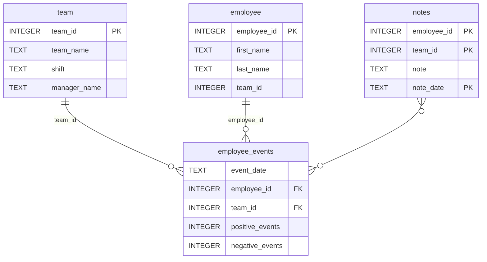

# Software Engineering for Data Scientists 

# Employee Recruitment Risk Dashboard
## Project Overview
This project provides a FastHTML dashboard for monitoring employee performance events and displaying a machine learning prediction of employee recruitment risk.

The solution consists of:

SQLite database
Python package (employee_events)
FastHTML dashboard
Pytest test suite
GitHub Actions CI workflow

### Repository Structure
```
├── README.md
├── assets
│   ├── model.pkl
│   └── report.css
├── env
├── python-package
│   ├── employee_events
│   │   ├── __init__.py
│   │   ├── employee.py
│   │   ├── employee_events.db
│   │   ├── query_base.py
│   │   ├── sql_execution.py
│   │   └── team.py
│   ├── requirements.txt
│   ├── setup.py
├── report
│   ├── base_components
│   │   ├── __init__.py
│   │   ├── base_component.py
│   │   ├── data_table.py
│   │   ├── dropdown.py
│   │   ├── matplotlib_viz.py
│   │   └── radio.py
│   ├── combined_components
│   │   ├── __init__.py
│   │   ├── combined_component.py
│   │   └── form_group.py
│   ├── dashboard.py
│   └── utils.py
├── requirements.txt
├── start
├── tests
    └── test_employee_events.py
```

### employee_events.db


# Environment Setup
## Clone repository

```bash
git clone https://github.com/gardnerlingjia/dsnd-dashboard-project
cd dsnd-dashboard-project
```

## Create virtual environment
```bash
python -m venv venv
```

Windows:
```bash
venv\Scripts\activate
```

Linux/macOS: 
```bash
source venv/bin/activate
```

## Install dependencies
```bash
pip install -r requirements.txt
```

## Install Python package
```bash
cd python-package
pip install -e .
cd ..
```

## Run Tests
```bash
pytest
```
Expected output:
```text
========================
passed
========================
```

## Run Dashboard
Navigate to report directory.
```bash
cd report
python dashboard.py
```
After the application starts, open:
```text
http://localhost:5001
```

## Database
python-package/employee_events/employee_events.db
The project uses a SQLite database located at:
```text
python-package/employee_events/employee_events.db
```
No additional database installation is required.

## CI/CD
GitHub Actions automatically runs Pytest when changes are pushed to main.
A GitHub Actions workflow is configured to:
1. Install dependencies
2. Execute the pytest test suite
3. Validate the project whenever code is pushed to the `main` branch


## Dependencies

Install all project dependencies:
```bash
pip install -r requirements.txt
```

Main dependencies:
- FastHTML
- Pandas
- NumPy
- Matplotlib
- Pytest
- SQLite3

## Reproducibility

The project includes:

- requirements.txt
- editable Python package installation
- automated tests
- GitHub Actions CI

These components allow another developer to reproduce the environment and run the dashboard from a clean clone of the repository.

## Build Distribution Package

```bash
cd python-package
python setup.py sdist
```
The generated package will be located in:
```text
python-package/dist/
```
Example:
```text
employee_events-0.0.tar.gz
```